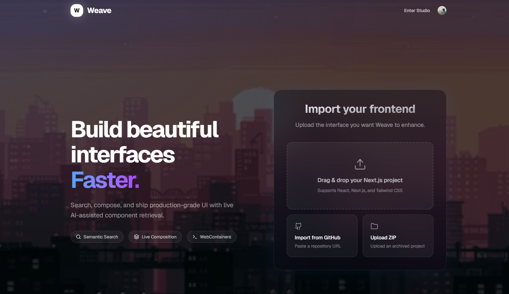

# weave

> AI-native frontend composition engine.



Weave turns frontend development into retrieval, composition, and live runtime editing.

Search across:

* shadcn/ui
* Aceternity UI
* Magic UI
* Watermelon
* and more

Then inject production-grade components directly into a live Next.js sandbox powered by WebContainers.

No copy-pasting.
No rebuilding the same landing page again and again.

---

## What it does

* semantic UI search
* AI-powered component retrieval
* live component injection
* sandboxed Next.js runtime
* composable landing page generation
* visual frontend composition
* real-time preview updates

---

## Stack

* Next.js
* Tailwind
* shadcn/ui
* Framer Motion
* WebContainer API
* LangGraph
* Playwright
* OpenAI

---

## Philosophy

Most AI website builders generate random UI.

Weave retrieves, composes, and adapts curated frontend systems instead.

Generation-first is noisy.
Composition-first scales.

---

## Vision

Frontend development becomes:

```txt
Prompt
  ↓
Retrieve
  ↓
Compose
  ↓
Inject
  ↓
Ship
```

---

## Status

alpha — building the future of AI-native frontend tooling.
